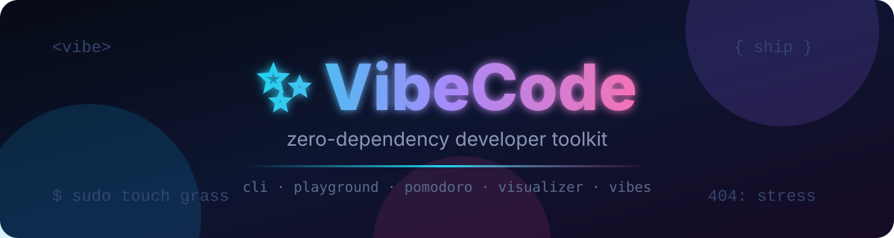

[](https://github.com/FsbAidolBIO/VibeCode/actions/workflows/ci.yml)
[](https://www.python.org/)
[](pyproject.toml)
[](index.html)
[](LICENSE)
[](CONTRIBUTING.md)

# ✨ VibeCode

**A developer toolkit with zero dependencies and maximum vibes.**

Two things, both genuinely useful, both work out of the box:

| | What | Deps | Run it |
|---|---|---|---|
| 💻 | **Terminal CLI** — `vibecode.py`: project analyzer, repo vibe-check, TODO manager, git stats, live dashboard… | *none* (Python stdlib) | `python vibecode.py --help` |
| 🌐 | **Web playground** — `index.html`: JSON formatter, regex tester, Base64, password generator, pomodoro, sorting visualizer, Markdown preview, color tools, cron, JWT, lorem, case converter | *none* (single file, offline) | double-click it, or `python vibecode.py serve` |

No `pip install`. No `npm install`. No signup, no tracking, no build step. Clone it, run it, love it.

---

## ⚡ Quick start

```bash
git clone https://github.com/FsbAidolBIO/VibeCode.git
cd VibeCode

python vibecode.py vibe-check . --roast   # brutally honest repo review 🔥
python vibecode.py analyze .              # what is this project made of?
python vibecode.py serve                  # open the web playground 🌐
```

## 💻 CLI — 16 commands, 1 file, 0 deps

Just Python 3.9+ and vibes:

| Command | What it does |
|---|---|
| `analyze [path]` | Languages, line counts, biggest files, ASCII charts (`--json` for scripts) |
| `vibe-check [path]` | Scores any repo 0–100 (`--roast` for pain, `--fix` scaffolds the missing bits!) |
| `banner TEXT` | Big ASCII banners from a built-in pixel font — no `figlet` needed (`--rainbow` for neon 🌈) |
| `dashboard` | Live terminal dashboard: clock, CPU/RAM/disk, git branch, project stats |
| `pomodoro` | 25/5 focus timer with progress bar right in your terminal 🍅 |
| `stats` | System snapshot: OS, Python, CPUs, load, memory, disk |
| `json` | Validate / pretty-print / minify JSON from file or stdin |
| `b64` | Unicode-safe Base64 encode/decode (emoji survive 🌊) |
| `passgen` | Cryptographically secure passwords + entropy estimate |
| `serve` | Serves the web playground locally and opens your browser |
| `todo` | Tiny TODO manager: `add`, `list`, `done`, `rm`, `clear` (stored in `~/.vibecode/`) |
| `git-stats` | Authors leaderboard, punchcard heatmap, last-12-weeks bars |
| `lorem` | Placeholder text: `--words`, `--sentences`, `--paragraphs` |
| `uuid` | Fresh UUIDs: v4/v1, `--upper`, `--no-dashes` |
| `hash` | md5/sha1/sha256/sha512 digests of text, file or stdin |
| `http` | Fetch a URL: status code, timing, headers, body preview |

Real output, zero mockups:

```
$ python vibecode.py analyze . --top 5

  📊  VibeCode analyze  —  /home/user/VibeCode

   Files:  12   Lines:  3838   Size:  168.1 KB
   (skipped 1 binary file(s))

   Languages
   Python            3 files    2,083 lines  ██████████████████████
   HTML              1 files    1,293 lines  ██████████████░░░░░░░░
   Markdown          3 files      303 lines  ███░░░░░░░░░░░░░░░░░░░
   YAML              1 files       60 lines  █░░░░░░░░░░░░░░░░░░░░░
   SVG               1 files       41 lines  ░░░░░░░░░░░░░░░░░░░░░░
   Other             2 files       31 lines  ░░░░░░░░░░░░░░░░░░░░░░
   TOML              1 files       27 lines  ░░░░░░░░░░░░░░░░░░░░░░

   Largest files (top 5)
     70.1 KB    1,293 lines  index.html
     60.6 KB    1,628 lines  vibecode.py
     16.4 KB      455 lines  tests/test_vibecode.py
     12.0 KB      239 lines  README.md
      2.5 KB       60 lines  .github/workflows/ci.yml

   Verdict: a healthy side project 🌱
```

```
$ python vibecode.py vibe-check . --roast

  🔮  Vibe-check  —  /home/user/VibeCode

   ✔  README file            +15
   ✔  License                +10
   ✔  .gitignore             +10
   ✔  Tests                  +15
   ✔  CI workflow            +10
   ✔  Recent commit (<30d)   +10
   ✔  Real code (>3 files)   +10
   ✔  Docs / contributing    +5
   ✔  Project manifest       +5
   ✔  Clean git tree          +10

   Score: 100/100  [████████████████████]
   Tier:  LEGENDARY  🏆 This repo belongs in a museum. Flawless.
```

```
$ python vibecode.py banner "SHIP IT" --char "#"

 ####  #   #  #####  ####          #####  #####
#      #   #    #    #   #           #      #
 ###   #####    #    ####            #      #
    #  #   #    #    #               #      #
####   #   #  #####  #             #####    #
```

```
$ python vibecode.py dashboard . --once

╭────────────────────────────────────────────────────────────╮
│ ✨ VibeCode Dashboard — Wednesday, 09 September 2026        │
│ 🕐 20:13:56                                                 │
│ ────────────────────────────────────────────────────────── │
│ SYSTEM   CPUs: 2   Load: 0.00 / 0.01 / 0.00                │
│   Memory: 288 / 3939 MB used                               │
│   Disk:   820.2 MB / 20.3 GB used ░░░░░░░░░░░░             │
│ ────────────────────────────────────────────────────────── │
│ GIT      branch: main  •  clean ✔                          │
│   Last: 600d201 📝 Sync README snapshots with real CLI outpu…
│ ────────────────────────────────────────────────────────── │
│ PROJECT  /home/user/VibeCode                               │
│   12 files • 3,838 lines  •  top: Python, HTML             │
│ ────────────────────────────────────────────────────────── │
│ “Talk is cheap. Show me the code.” — L. Torvalds           │
│ Press Ctrl+C to exit                                       │
╰────────────────────────────────────────────────────────────╯
```

> Want it as a real command? `pip install .` (or `pipx install .`) gives you a global `vibecode` — still zero dependencies.

## 🌐 Web playground — 13 tools in one file


`index.html` is the whole app. Save it, send it to a friend on a USB stick, open it on a plane — it just works:

| Tool | Highlights |
|---|---|
| 🏠 Home | Animated hero, feature map, typing effect |
| 📦 JSON | Format / minify / validate, sample, copy, download (`Ctrl+Enter` to format) |
| 🔍 Regex | Live highlighting, match list, capture groups, `g i m s` flags + find/replace mode |
| 🔐 Base64 | Unicode-safe encode/decode |
| 🎲 Password | `crypto.getRandomValues()`, length slider, live entropy meter |
| 🍅 Pomodoro | Focus/break cycles, progress ring, WebAudio chime, cycle dots |
| 📊 Sorting | Animated bubble / selection / insertion / quick / merge sort with counters |
| 📝 Markdown | Live preview, built-in mini parser, copy-as-HTML |
| 🎨 Colors | Palette generator + WCAG contrast checker + gradient builder |
| ⏰ Cron | Cron expression → human description + next 5 runs |
| 🔑 JWT | Decode header/payload, inspect claims, verify HS256 signatures |
| 📝 Lorem | Lorem ipsum paragraphs in one click |
| Aa Case | camelCase, snake_case, kebab-case… click any to copy |

Run it:

```bash
python vibecode.py serve          # serves + opens http://localhost:8000/
# ...or just double-click index.html. That's it. That's the install.
```

> 💡 Tip: enable **GitHub Pages** (Settings → Pages → Deploy from branch) and your playground gets a public URL for free.

## 🏆 We dogfood hard

This repo scores **100/100 LEGENDARY** on its own `vibe-check` — and CI fails the build if it ever drops below 80:

```yaml
- name: Dogfood — repo must pass its own vibe-check
  run: |
    python vibecode.py vibe-check . --json | python -c "...assert score >= 80..."
```

Plus 42 unit tests (stdlib `unittest`, no pytest needed) and an embedded-JS syntax check for `index.html` on every push, across Python 3.9/3.11/3.12.

## 📁 Structure

```
VibeCode/
├── vibecode.py            # the CLI — 16 commands, stdlib only
├── index.html             # the web playground — 13 tools, single file
├── tests/
│   └── test_vibecode.py   # 42 tests, unittest, zero deps
├── assets/
│   ├── banner.svg         # README banner (hand-made, crisp)
│   └── hero.png           # playground artwork
├── .github/workflows/ci.yml  # tests + JS check + vibe-check gate
├── CONTRIBUTING.md        # keep it dependency-free 🙏
├── pyproject.toml         # optional: pip install . → global `vibecode`
├── CHANGELOG.md          # release notes
├── LICENSE                # MIT
└── README.md              # you are here 👋
```

## 🗺 Roadmap

- [x] `vibecode todo` — terminal TODO manager ✅ v1.1.0
- [x] `vibecode git-stats` — authors, punchcard, weekly bars ✅ v1.1.0
- [x] Playground: cron parser, JWT decoder, lorem generator ✅ v1.1.0
- [ ] Shell completions (`vibecode completions bash|zsh|fish`)
- [ ] Sorting race mode: every algorithm, same array, one winner 🏁
- [ ] More playground tools: unix-time converter, HTML entity codec
- [ ] i18n for the playground (🇷🇺 first)
- [ ] Your idea here — open an issue!

## 🤝 Contributing

See [CONTRIBUTING.md](CONTRIBUTING.md). TL;DR: **no new dependencies** — if it needs `pip`/`npm`, it doesn't ship. PRs welcome! 💜

## 🇷🇺 По-русски

**VibeCode** — это тулкит разработчика с нулем зависимостей:

- 💻 **CLI на Python** (`vibecode.py`, 16 команд): анализ проекта, `vibe-check` репозитория (оценка 0–100, режимы `--roast` 🌶 и `--fix` 🛠), ASCII-баннеры (есть `--rainbow` 🌈), TODO-менеджер, git-статистика с панчкардом, помодоро-таймер, живой дашборд, UUID/lorem/hash/http-утилиты, генератор паролей, Base64, форматирование JSON.
- 🌐 **Веб-площадка** (`index.html`): 13 инструментов в одном файле — работает даже без интернета: JSON, regex (+replace), Base64, пароли, помодоро, сортировки (+merge), Markdown, цвета (+градиенты), Cron-парсер, JWT-декодер, Lorem, конвертер кейсов.
- ✅ 42 автотеста, CI на каждый пуш, MIT-лицензия.

```bash
git clone https://github.com/FsbAidolBIO/VibeCode.git && cd VibeCode
python vibecode.py vibe-check . --roast
python vibecode.py serve
```

## 📄 License

MIT — do whatever you want, just keep the vibe. See [LICENSE](LICENSE).

---

<p align="center">If this made you smile — <b>⭐ star the repo</b> and share the vibe.<br>Built with Python, vanilla JS and an unreasonable love for side projects. 💜</p>
